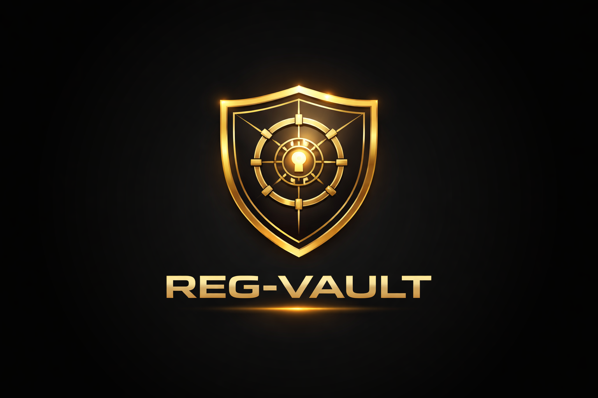

# REG-VAULT

**AI-Driven FCA Authorisation Platform**

> Not advice. Not templates. A verifiable regulatory production system.



## Overview

REG-VAULT is a regulator-grade, AI-driven FCA application production platform that automates the creation of complete FCA authorisation and registration application bundles, with human verification, full auditability, and traceability to regulation.

The platform converts unstructured founder input into:
- FCA-ready application answers
- Business plans and financial models
- Policies and procedures mapped to regulation
- Funds flow and process flow diagrams
- A submission-ready FCA bundle pack
- Post-submission FCA caseworker correspondence support

## Target Customers

- UK & EU fintech founders
- Payment service providers
- Consumer credit firms
- Open Banking firms
- Mortgage & insurance intermediaries

## Supported Licence Categories

### Phase 1 (MVP)
- Small Payment Institution (SPI)
- Small Electronic Money Institution (Small EMI)

### Phase 2
- Authorised Payment Institution (API)
- Electronic Money Institution (EMI)
- Open Banking (AIS / PISP / RAISP)

### Phase 3 (Enterprise)
- Consumer Credit
- Mortgages & Insurance
- Credit Institution / Banking licence

## Tech Stack

- **Frontend:** Next.js 14 (React) with TypeScript
- **Styling:** Tailwind CSS with custom gold/black glassmorphism theme
- **Backend:** Supabase (PostgreSQL, Auth, Storage, RLS)
- **AI Orchestration:** Stateless worker service
- **Diagrams:** Mermaid.js
- **PDF Generation:** jsPDF

## Getting Started

### Prerequisites

- Node.js 18+
- npm or yarn
- Supabase account

### Installation

1. Clone the repository:
```bash
cd /Users/fredmanu/Projects/reg-vault
```

2. Install dependencies:
```bash
npm install
```

3. Set up environment variables:
```bash
cp .env.example .env.local
```

4. Update `.env.local` with your Supabase credentials:
```
NEXT_PUBLIC_SUPABASE_URL=your-supabase-url
NEXT_PUBLIC_SUPABASE_ANON_KEY=your-supabase-anon-key
```

5. Run the development server:
```bash
npm run dev
```

6. Open [http://localhost:3000](http://localhost:3000)

### Database Setup

1. Create a new Supabase project
2. Run the migration:
```bash
# Using Supabase CLI
supabase db push

# Or manually run the SQL in Supabase SQL Editor
# See: supabase/migrations/001_initial_schema.sql
```

## Project Structure

```
reg-vault/
├── public/
│   └── images/
│       └── logo.png
├── src/
│   ├── app/                    # Next.js App Router
│   │   ├── layout.tsx
│   │   └── page.tsx
│   ├── components/
│   │   ├── auth/               # Authentication components
│   │   ├── common/             # Shared UI components
│   │   ├── dashboard/          # Dashboard components
│   │   ├── intake/             # Client intake wizard
│   │   ├── policies/           # Policy generation
│   │   ├── diagrams/           # Flow diagrams
│   │   ├── bundle/             # FCA bundle builder
│   │   └── correspondence/     # FCA caseworker module
│   ├── data/
│   │   └── rkb/                # Regulatory Knowledge Base data
│   ├── hooks/                  # Custom React hooks
│   ├── lib/                    # Utilities and helpers
│   ├── services/               # API services
│   ├── styles/
│   │   └── globals.css         # Global styles
│   └── types/
│       └── database.ts         # TypeScript types
├── supabase/
│   └── migrations/
│       └── 001_initial_schema.sql
├── docs-prd.pdf                # Product Requirements Document
├── docs-rkb.pdf                # Regulatory Knowledge Base Design
├── package.json
├── tailwind.config.js
├── tsconfig.json
└── README.md
```

## Functional Modules

### 1. Client Intake & Fit-and-Proper Module
Capture structured regulatory facts and risk indicators through adaptive FCA-style questionnaires.

### 2. Licence Detection & Scope Engine
Automatically determine correct FCA licence category and required permissions.

### 3. Regulatory Research Engine (RKB)
Curated knowledge base providing authoritative regulatory grounding with full traceability.

### 4. Business Plan & Financial Model Module
Generate FCA-grade business plans with 3-5 year financial projections.

### 5. Policies & Procedures Factory
AI-generated policies mapped to regulation with bidirectional traceability.

### 6. Funds Flow & Process Flow Engine
Template-driven Mermaid/BPMN-style diagrams for regulatory submissions.

### 7. FCA Application Pack Builder
Field-by-field FCA form answers with evidence index and submission bundle.

### 8. FCA Caseworker Correspondence Module
Draft responses to FCA queries with regulation citations.

## Design System

- **Theme:** Dark mode with gold glow accents
- **Style:** Glassmorphism panels with subtle motion
- **Primary Color:** Gold (#D4AF37)
- **Background:** Black (#000000)
- **Font:** Inter (body), Space Grotesk (headings)

## Non-Functional Requirements

- Multi-tenant isolation (Row Level Security)
- Immutable audit trail
- Human-in-the-loop enforcement
- Stateless AI processing
- GDPR-aligned deletion workflows

## License

Proprietary - All rights reserved

## Documentation

- [Product Requirements Document](./docs-prd.pdf)
- [Regulatory Knowledge Base Design](./docs-rkb.pdf)
